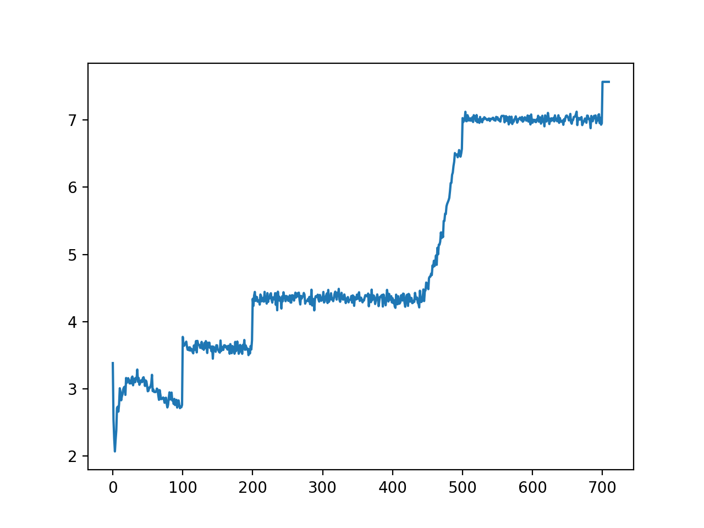

# Portfolio-Investment-Strategy

### Run this experiment by `python3 -i run.py`. Use `-i` for future fine-tune.

#### 2021 Nov. 10 1:43AM

Total expanded states 855891

Max profit 11.266000000000002

Max profit path:

        At time 0. 
                Ongoing: ['B01_2/10', 'B02_4/10', 'B03_1/10', 'B04_3/10'].
        At time 1. 
                Ongoing: ['B01_UPG_3/10', 'B02_5/10', 'B03_2/10', 'B04_4/10', 'A11_1/10'].
        At time 2. 
                Ongoing: ['B01_UPG_4/10', 'B02_6/10', 'B03_3/10', 'B04_5/10', 'A11_2/10', 'A22_1/10'].
        At time 3. 
                Ongoing: ['B01_UPG_5/10', 'B02_7/10', 'B03_4/10', 'B04_6/10', 'A11_3/10', 'A22_2/10'].
        At time 4. 
                Ongoing: ['B01_UPG_6/10', 'B02_8/10', 'B03_5/10', 'B04_7/10', 'A11_4/10', 'A22_3/10'].
        At time 5. 
                Ongoing: ['B01_UPG_7/10', 'B02_9/10', 'B03_6/10', 'B04_8/10', 'A11_5/10', 'A22_UPG_4/10', 'A52_1/10', 'A53_1/10'].

